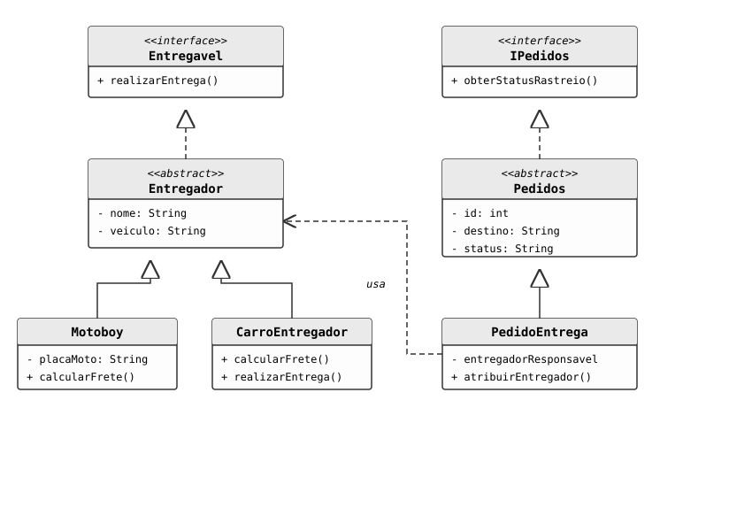

# Sistema de Logística para Entregas (E-commerce)

**CheckPoint 2 (CP2)**, disciplina de **Domain Driven Design** na **FIAP**. O objetivo é simular o funcionamento de um serviço de logística de entregas, com foco total na correta aplicação dos conceitos de Programação Orientada a Objetos (POO).

## 🎓 Informações do Projeto
* **Faculdade:** FIAP
* **Professor:** Prof. Damiana Costa
* **Integrantes:** Bernardo Moreira RM: 564103, Pedro Batista RM: 563220, Renan Jordão RM: 560618, Larissa Shiba RM: 560462

## 🚀 Objetivo do Sistema
Desenvolver um sistema orientado a objetos que gerencie o cadastro de entregadores, a criação de pedidos e o fluxo básico de uma operação logística, permitindo a atribuição de entregas e atualização de status em tempo real.

## 🛠️ Decisões de Modelagem (Respostas Discursivas)

### 1. Herança
**Explicação:** A herança foi utilizada para criar uma hierarquia entre a classe base `Entregador` e as classes especializadas `Motoboy` e `CarroEntregador`.
**Problema Resolvido:** Ela resolveu o problema de redundância de código. Atributos comuns como `nome` e `veiculo` ficam na classe pai, enquanto comportamentos específicos (como o cálculo de frete diferenciado e a placa da moto) ficam nas classes filhas.

### 2. Interfaces
**Explicação:** Foram criadas as interfaces `Entregavel` e `IPedidos`.
**Vantagem:** A interface `Entregavel` define o contrato para a ação de entrega (`realizarEntrega`), garantindo que qualquer novo tipo de entregador (ex: Drone) siga o mesmo padrão. Já a `IPedidos` permite que diferentes tipos de pedidos sejam rastreáveis de forma padronizada, desacoplando a lógica de rastreio da implementação do pedido.

### 3. Classe Abstrata
**Explicação:** A classe `Entregador` foi definida como `abstract`.
**Justificativa:** Ela não poderia ser uma classe comum porque, no domínio de logística, não existe um "entregador genérico". Um entregador deve obrigatoriamente possuir um veículo (Moto, Carro, etc.) para operar. A abstração impede que o sistema instancie um objeto `Entregador` incompleto, garantindo a integridade das regras de negócio.

## 📁 Estrutura do Projeto
* **`Entregador` (Abstract):** Base para todos os prestadores de serviço.
* **`Motoboy` & `CarroEntregador`:** Implementações concretas com regras de frete distintas.
* **`Pedidos` (Abstract) & `PedidoEntrega`:** Gerenciamento dos dados da entrega e destino.
* **`Entregavel` & `IPedidos` (Interfaces):** Definição de comportamentos obrigatórios.
* **`Main`:** Classe principal com menu interativo via `Scanner`.
* 
* 